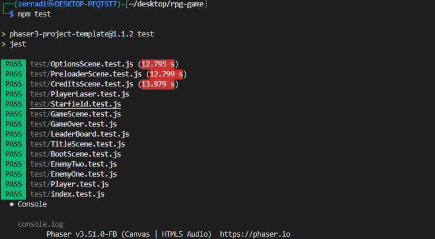
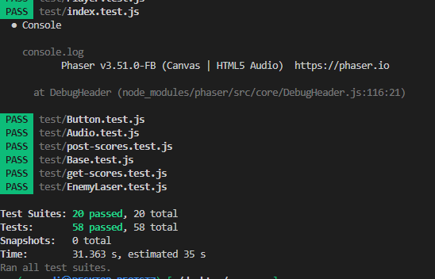

#  Space Shooter


## built width

- Javascript
- Dom Manipulation
- Arrow function
- Phaser 3

## Description

> This was my final project of the JavaScript module and the aim was to create a shooter game using the framework `Phaser`


## Instructions 🎮

### Move Character

- `UP` - `Arrow UP key`
- `DOWN` - `Arrow DOWN key`
- `LEFT` - `Arrow LEFT key`
- `RIGHT` - `Arrow RIGHT key`

### Shoot

- `Laser` - `Space bar`

## Built With 🛠

```
- JavaScript
- Phaser 3.51.0
- Jest
- Webpack
- Netlify
- VS Code
```

## Live Demo 📺

<a href="https://space-salvation.netlify.app/"></a>

## Loom video
[Loom video!](https://www.loom.com/share/2624f51a52694a798a06c912ae00fcc6)


## Install 🛠


-  Open your `Terminal`
- `git clone git@github.com:dasileker/rpg-game.git` to download <b>or</b> you can download using `HTTPS` by running `git clone https://github.com/dasileker/rpg-game.git` in the terminal.
- `cd shooter-game` to enter the directory.
-  `npm i` to install all the packages.
- `npm run build` to build the app.
-  If you would like to edit the code for your preference then you can enter development mode by running `npm start` in the terminal.


## Testing ⚙

- I have used Jest to test my code, you can find more info here: [jest](https://jestjs.io/)

- Open `Terminal` again
- Run `cd shooter-game` to enter the directory
- Run `npm test` to start testing
- All tests will pass 👌

- 
- 

## Author

### ZErradi Amine

- [Github](https://www.github.com/dasileker/).
- [linkedIn](https://www.linkedin.com/zerradi)
### 🤝 Contributing

Contributions, issues and feature requests are welcome!

Feel free to check the [issues page](https://github.com/DcRonan/shooter-game/issues).

### Show your support

Give a ⭐️ if you like this project!

### License
- MIT LICENSE

